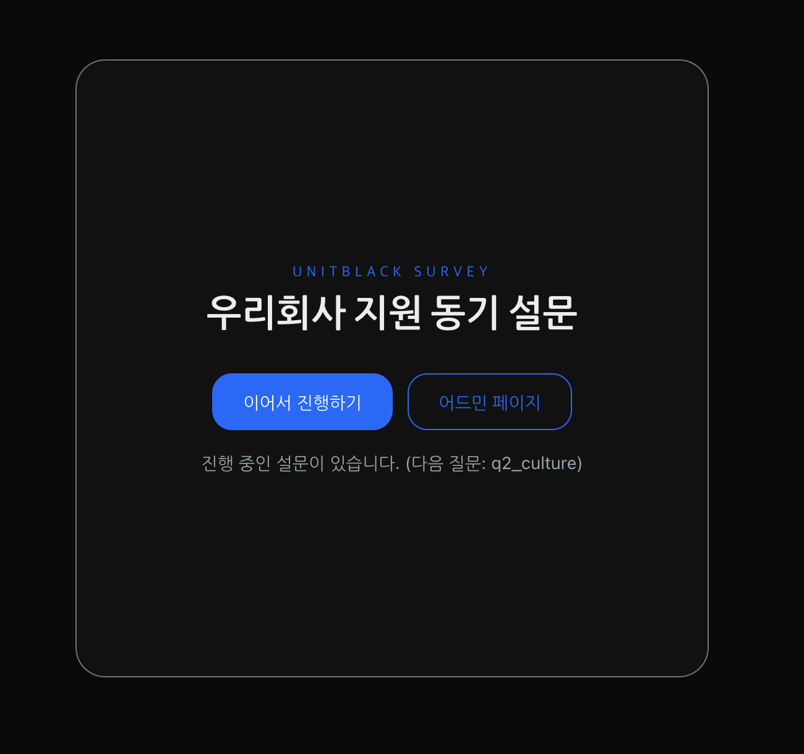
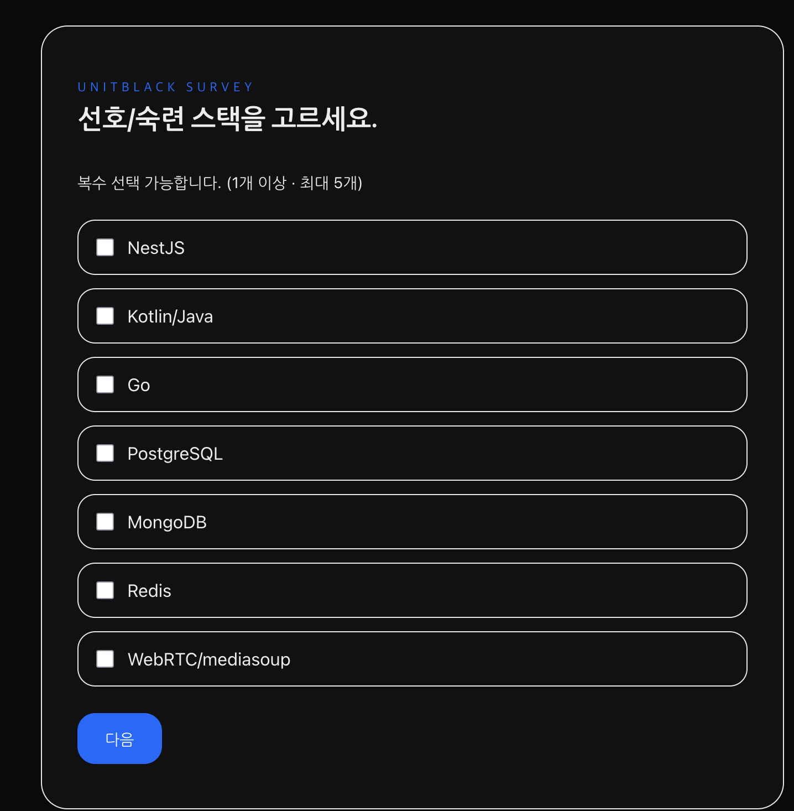
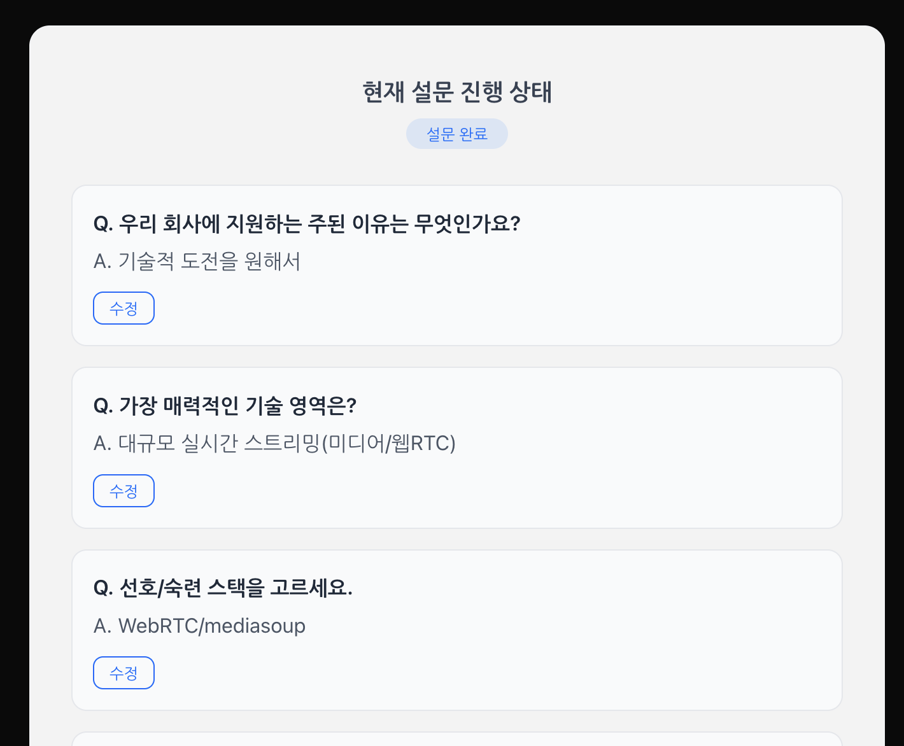
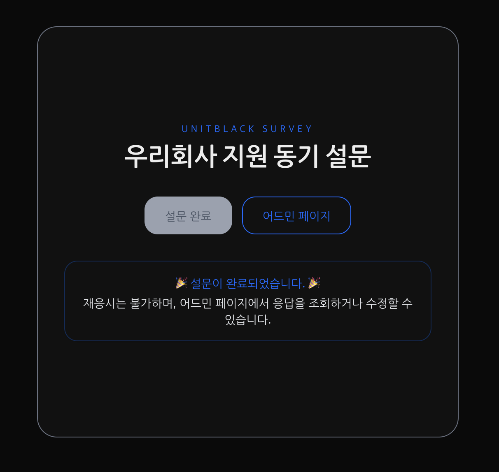
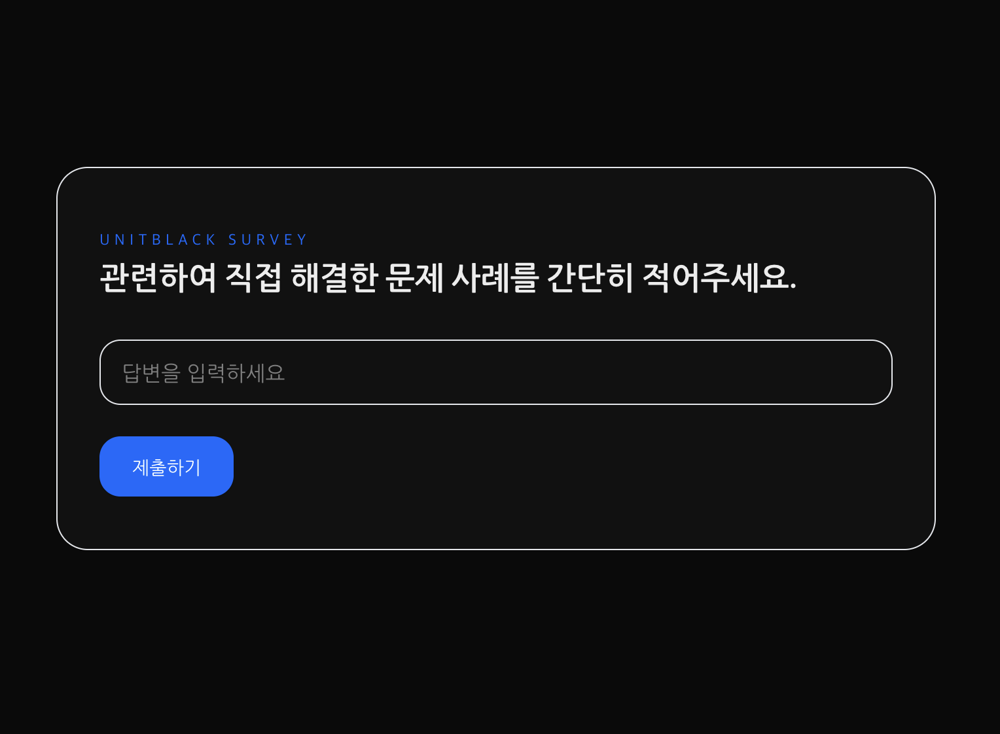
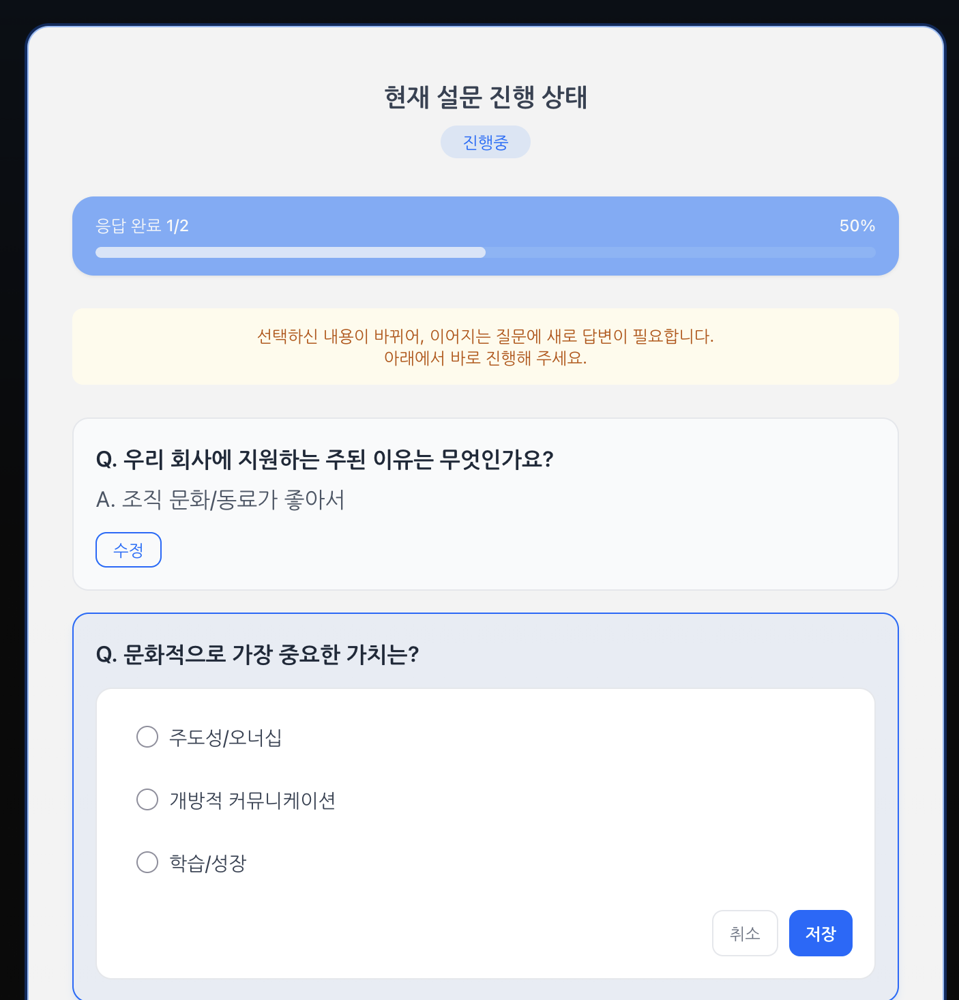

## UnitBlack Survey

간단한 설문 흐름(질문 분기, 진행 저장, 완료 제출)과 기본 Admin 화면을 가진 Next.js App Router 기반 프로젝트입니다.

## 설계 및 구현 의사결정 근거

### 상태관리 (State Management)

- **선택**: 클라이언트 상태는 `zustand` 단일 전역 스토어(`app/(survey)/_store/useSurveyStore.ts`)로 관리합니다.
  - **이유**: 설문은 비교적 단순한 상태 전이(현재 질문, 답변 맵, 진행 상태)와 강한 국소성(설문 범위) 특성을 가짐. `zustand`는 보일러플레이트가 적고 SSR 친화적이며 타입스크립트 연동이 간단합니다.
- **핵심 상태**: `survey`, `currentQuestionId`, `answers`, `status(idle|inProgress|completed|error)`.
- **지속성**: 진행상태는 브라우저 `localStorage`를 통해 저장/복원합니다(`app/(survey)/_lib/storage.ts`). 새로고침/이탈 후 복귀 시에도 이어서 진행 가능합니다.
- **진행 계산**: 답변 변경 시 `evaluateSurveyProgress` 로 현재 질문/다음 질문/상태를 재평가하여 루프·무효 분기 등 비정상 상태를 감지합니다.

### 세션/재개/완료 정책

- **자동 저장 & 복구**: 각 답변 입력 시 즉시 로컬 저장, 초기 진입 시 저장된 `nextQuestionId`/`answers` 기반으로 복구합니다.
- **완료 후 재응시 차단**: 서버가 `status: completed` 응답을 반환하면 완료 화면으로 전환하고 추가 제출을 막습니다. 서버는 동일 세션에 대한 추가 제출을 `403` 으로 차단합니다(`app/api/sessions/[id]/answers/route.ts`).
- **옵셔널 문항 진행**: `required=false` 인 문항도 DTO 스펙에 맞춰 "빈 답변"(answer 생략)으로 제출하여 다음 문항으로 진행합니다.

### 라우팅 구조 및 분기 처리 로직

- **App Router 사용**: Next.js App Router 하위 경로로 화면을 구성합니다.
  - 사용자 설문 플로우: `app/(survey)/page.tsx`, `app/(survey)/questions/page.tsx`, `app/(survey)/completed/page.tsx`
  - Admin: `app/(admin)/admin/page.tsx`
  - 로딩 상태: 각 그룹의 `loading.tsx`
- **분기 로직**: 질문 간 이동은 답변 기반 규칙으로 계산합니다.
  - 핵심 유틸: `app/(survey)/_lib/navigation.ts`
    - `getNextQuestionIdFromAnswer`와 `resolveConditionalNext`가 단일/복수 선택 답변과 조건 라우팅(`next`, `default`, 조건부 when)을 해석합니다.
  - 스토어에서 답변 변경 시 다음 질문을 계산하여 `currentQuestionId` 업데이트.
  - 순환 감지/잘못된 다음 질문은 `status: error` 로 표기하여 흐름 중단을 방지합니다.

### API 연동 및 인증/헤더

- **세션 토큰 헤더**: 모든 세션 관련 API는 `X-Session-Token: <랜덤 토큰>` 헤더를 사용합니다. 세션 시작 시 토큰을 생성/보관하여 동일 브라우저 세션 동안 재사용합니다.
- **DTO 준수**: 클라이언트는 서버 스펙에 맞춰 `questionId`, `answer`(선택형은 optionId/optionIds, 서술형은 text), `submittedAt` 필드를 전송합니다.
- **서버 검증**: 서버는 분기 위반(없는 옵션/다음 질문), 완료된 세션에 대한 제출, 잘못된 세션/토큰에 대한 접근을 명시적 에러 코드로 응답합니다(아래 표 참조).

### 에러 처리 및 접근성(Accessibility)

- **에러 처리**
  - 설문 그래프 오류(없는 질문, 순환 발생)를 스토어 레벨에서 감지하고 `status: error` 로 전파합니다. 화면단에서 에러 상태에 따른 안내를 노출하도록 구성합니다.
  - 네트워크/API 오류는 기본적으로 사용자 메시지와 재시도 유도(스피너/버튼) 패턴을 사용합니다.
- **접근성 고려**
  - 입력 컴포넌트는 네이티브 컨트롤 기반(`radio`, `checkbox`, `input`) 구성으로 기본 키보드 내비게이션을 보장합니다.
  - 버튼/링크 등 인터랙티브 요소는 역할/라벨을 명시하고, 비동기 상태에서는 시각적 피드백(`app/components/Spinner.tsx`)을 제공합니다.

## 로컬 실행 및 테스트 방법

### 실행 환경 및 설치 절차

- **요구사항**

  - Node.js >= 18.18 (권장: 20 LTS)
  - Yarn 4

- **설치 & 실행**
  - 이 프로젝트는 `.env.local.example` 파일을 포함하며, 실행 전 `.env.local`로 이름을 변경해야 합니다.

```bash
yarn install
yarn dev
# http://localhost:3000 접속
```

### 백엔드 모킹 포함 로컬 실행 방법

- 이 프로젝트는 Next.js API Routes를 이용해 **로컬 인메모리 Mock 백엔드**를 내장합니다.
  - 설문 데이터: `app/data/survey.json`
  - 엔드포인트:
    - `GET /api/surveys/[id]` — 설문 스키마 조회
    - `POST /api/sessions` — 세션 생성 (인메모리 저장)
    - `GET /api/sessions/[id]` — 세션 조회
    - `POST /api/sessions/[id]/answers` — 답변 제출
  - 세션 저장소: `app/api/sessions/sessionStore.ts` (서버 런타임 메모리 기반. 서버 재시작 시 사라짐)
- 별도 백엔드 또는 환경변수 설정 없이 `yarn dev` 만으로 프론트+Mock API가 함께 동작합니다.
  - 에러/상태 코드(모킹):
    - 403 — 유효하지 않은/완료된 세션, 세션 불일치
    - 400 — DTO 검증 실패(예: `questionId` 누락)
    - 404 — 존재하지 않는 설문/질문
    - 422 — 허용되지 않은 분기(없는 옵션/다음 질문)

### 테스트 실행

```bash
yarn test
```

- 테스트 러너는 `vitest`를 사용합니다. DOM 관련 테스트는 `jsdom` 환경을 사용하며, 단위 유틸 테스트 예시는 `app/(admin)/admin/_utils/utils.test.ts` 등에 위치합니다.

## 기타 설명이 필요한 부분

### 가정 (Assumptions)

- 설문 그래프는 유효하다는 가정 하에 제공되며, 일부 방어 로직으로 순환/누락을 감지합니다.
- 조건 분기는 단일/다중 선택형 질문에 한해 상세 분기를 지원합니다. 서술형 답변은 기본 분기만 사용합니다.
- 진행 저장은 브라우저 단일 기기/단일 사용자 기준의 로컬 지속성만 고려합니다.

### 트레이드오프 (Trade-offs)

- **인메모리 세션 스토어**: 구현 단순성과 로컬 개발 편의성은 높지만, 실제 운영에는 적합하지 않습니다(스케일·영속성·장애 복구 미흡).
- **클라이언트 주도 분기 계산**: 빠른 인터랙션과 단순한 서버 인터페이스를 제공하지만, 서버 권위 검증이 약합니다. 서버사이드 유효성 검증이 필요한 환경에서는 추가 검증 레이어가 필요합니다.
- **Zustand 채택**: 러닝커브와 보일러플레이트가 낮은 대신, 복잡한 비동기/파생 상태가 많아지면 구조화(미들웨어/분리)가 필요할 수 있습니다.

### 미완성/추가 구현이 필요한 부분

- **영속적 저장소**: 세션/답변을 데이터베이스로 영속화하고, 서버사이드 유효성/권한 검증 추가
- **에러 화면 고도화**: `error.tsx` 경계, 재시도/복구 플로우, 서버 오류 코드 매핑
- **E2E 테스트**: Playwright/Cypress 기반 시나리오 테스트와 MSW를 통한 API 모킹 정교화

## API 에러/상태 코드 가이드

| 코드            | 의미                              |
| --------------- | --------------------------------- |
| 400 Bad Request | DTO 검증 실패 ## UnitBlack Survey |

간단한 설문 흐름(질문 분기, 진행 저장, 완료 제출)과 기본 Admin 화면을 가진 Next.js App Router 기반 프로젝트입니다.

## 설계 및 구현 의사결정 근거

### 상태관리 (State Management)

- **선택**: 클라이언트 상태는 `zustand` 단일 전역 스토어(`app/(survey)/_store/useSurveyStore.ts`)로 관리합니다.
  - **이유**: 설문은 비교적 단순한 상태 전이(현재 질문, 답변 맵, 진행 상태)와 강한 국소성(설문 범위) 특성을 가짐. `zustand`는 보일러플레이트가 적고 SSR 친화적이며 타입스크립트 연동이 간단합니다.
- **핵심 상태**: `survey`, `currentQuestionId`, `answers`, `status(idle|inProgress|completed|error)`.
- **지속성**: 진행상태는 브라우저 `localStorage`를 통해 저장/복원합니다(`app/(survey)/_lib/storage.ts`). 새로고침/이탈 후 복귀 시에도 이어서 진행 가능합니다.
- **진행 계산**: 답변 변경 시 `evaluateSurveyProgress` 로 현재 질문/다음 질문/상태를 재평가하여 루프·무효 분기 등 비정상 상태를 감지합니다.

### 세션/재개/완료 정책

- **자동 저장 & 복구**: 각 답변 입력 시 즉시 로컬 저장, 초기 진입 시 저장된 `nextQuestionId`/`answers` 기반으로 복구합니다.
- **완료 후 재응시 차단**: 서버가 `status: completed` 응답을 반환하면 완료 화면으로 전환하고 추가 제출을 막습니다. 서버는 동일 세션에 대한 추가 제출을 `403` 으로 차단합니다(`app/api/sessions/[id]/answers/route.ts`).
- **옵셔널 문항 진행**: `required=false` 인 문항도 DTO 스펙에 맞춰 "빈 답변"(answer 생략)으로 제출하여 다음 문항으로 진행합니다.

### 라우팅 구조 및 분기 처리 로직

- **App Router 사용**: Next.js App Router 하위 경로로 화면을 구성합니다.
  - 사용자 설문 플로우: `app/(survey)/page.tsx`, `app/(survey)/questions/page.tsx`, `app/(survey)/completed/page.tsx`
  - Admin: `app/(admin)/admin/page.tsx`
  - 로딩 상태: 각 그룹의 `loading.tsx`
- **분기 로직**: 질문 간 이동은 답변 기반 규칙으로 계산합니다.
  - 핵심 유틸: `app/(survey)/_lib/navigation.ts`
    - `getNextQuestionIdFromAnswer`와 `resolveConditionalNext`가 단일/복수 선택 답변과 조건 라우팅(`next`, `default`, 조건부 when)을 해석합니다.
  - 스토어에서 답변 변경 시 다음 질문을 계산하여 `currentQuestionId` 업데이트.
  - 순환 감지/잘못된 다음 질문은 `status: error` 로 표기하여 흐름 중단을 방지합니다.

### API 연동 및 인증/헤더

- **세션 토큰 헤더**: 모든 세션 관련 API는 `X-Session-Token: <랜덤 토큰>` 헤더를 사용합니다. 세션 시작 시 토큰을 생성/보관하여 동일 브라우저 세션 동안 재사용합니다.
- **DTO 준수**: 클라이언트는 서버 스펙에 맞춰 `questionId`, `answer`(선택형은 optionId/optionIds, 서술형은 text), `submittedAt` 필드를 전송합니다.
- **서버 검증**: 서버는 분기 위반(없는 옵션/다음 질문), 완료된 세션에 대한 제출, 잘못된 세션/토큰에 대한 접근을 명시적 에러 코드로 응답합니다(아래 표 참조).

### 에러 처리 및 접근성(Accessibility)

- **에러 처리**
  - 설문 그래프 오류(없는 질문, 순환 발생)를 스토어 레벨에서 감지하고 `status: error` 로 전파합니다. 화면단에서 에러 상태에 따른 안내를 노출하도록 구성합니다.
  - 네트워크/API 오류는 기본적으로 사용자 메시지와 재시도 유도(스피너/버튼) 패턴을 사용합니다.
- **접근성 고려**
  - 입력 컴포넌트는 네이티브 컨트롤 기반(`radio`, `checkbox`, `input`) 구성으로 기본 키보드 내비게이션을 보장합니다.
  - 버튼/링크 등 인터랙티브 요소는 역할/라벨을 명시하고, 비동기 상태에서는 시각적 피드백(`app/components/Spinner.tsx`)을 제공합니다.

## 로컬 실행 및 테스트 방법

### 실행 환경 및 설치 절차

- **요구사항**

  - Node.js >= 18.18 (권장: 20 LTS)
  - Yarn 4

- **설치 & 실행**

```bash
yarn install
yarn dev
# http://localhost:3000 접속
```

### 백엔드 모킹 포함 로컬 실행 방법

- 이 프로젝트는 Next.js API Routes를 이용해 **로컬 인메모리 Mock 백엔드**를 내장합니다.
  - 설문 데이터: `app/data/survey.json`
  - 엔드포인트:
    - `GET /api/surveys/[id]` — 설문 스키마 조회
    - `POST /api/sessions` — 세션 생성 (인메모리 저장)
    - `GET /api/sessions/[id]` — 세션 조회
    - `POST /api/sessions/[id]/answers` — 답변 제출
  - 세션 저장소: `app/api/sessions/sessionStore.ts` (서버 런타임 메모리 기반. 서버 재시작 시 사라짐)
- 별도 백엔드 또는 환경변수 설정 없이 `yarn dev` 만으로 프론트+Mock API가 함께 동작합니다.
  - 에러/상태 코드(모킹):
    - 403 — 유효하지 않은/완료된 세션, 세션 불일치
    - 400 — DTO 검증 실패(예: `questionId` 누락)
    - 404 — 존재하지 않는 설문/질문
    - 422 — 허용되지 않은 분기(없는 옵션/다음 질문)

### 테스트 실행

```bash
yarn test
```

- 테스트 러너는 `vitest`를 사용합니다. DOM 관련 테스트는 `jsdom` 환경을 사용하며, 단위 유틸 테스트 예시는 `app/(admin)/admin/_utils/utils.test.ts` 등에 위치합니다.

## 기타 설명이 필요한 부분

### 가정 (Assumptions)

- 설문 그래프는 유효하다는 가정 하에 제공되며, 일부 방어 로직으로 순환/누락을 감지합니다.
- 조건 분기는 단일/다중 선택형 질문에 한해 상세 분기를 지원합니다. 서술형 답변은 기본 분기만 사용합니다.
- 진행 저장은 브라우저 단일 기기/단일 사용자 기준의 로컬 지속성만 고려합니다.

### 트레이드오프 (Trade-offs)

- **인메모리 세션 스토어**: 구현 단순성과 로컬 개발 편의성은 높지만, 실제 운영에는 적합하지 않습니다(스케일·영속성·장애 복구 미흡).
- **클라이언트 주도 분기 계산**: 빠른 인터랙션과 단순한 서버 인터페이스를 제공하지만, 서버 권위 검증이 약합니다. 서버사이드 유효성 검증이 필요한 환경에서는 추가 검증 레이어가 필요합니다.
- **Zustand 채택**: 러닝커브와 보일러플레이트가 낮은 대신, 복잡한 비동기/파생 상태가 많아지면 구조화(미들웨어/분리)가 필요할 수 있습니다.

### 미완성/추가 구현이 필요한 부분

- **영속적 저장소**: 세션/답변을 데이터베이스로 영속화하고, 서버사이드 유효성/권한 검증 추가
- **에러 화면 고도화**: `error.tsx` 경계, 재시도/복구 플로우, 서버 오류 코드 매핑
- **E2E 테스트**: Playwright/Cypress 기반 시나리오 테스트와 MSW를 통한 API 모킹 정교화

## 🖼️ 주요 화면

| 메인 화면                               | 설문 진행                                 | 어드민                                        |
| --------------------------------------- | ----------------------------------------- | --------------------------------------------- |
| [설문 진행중] |  [항목 선택] |  [제출 설문 조회] |
| [설문 완료] |  텍스트 입력  |  [수정 진행중]     |

|
